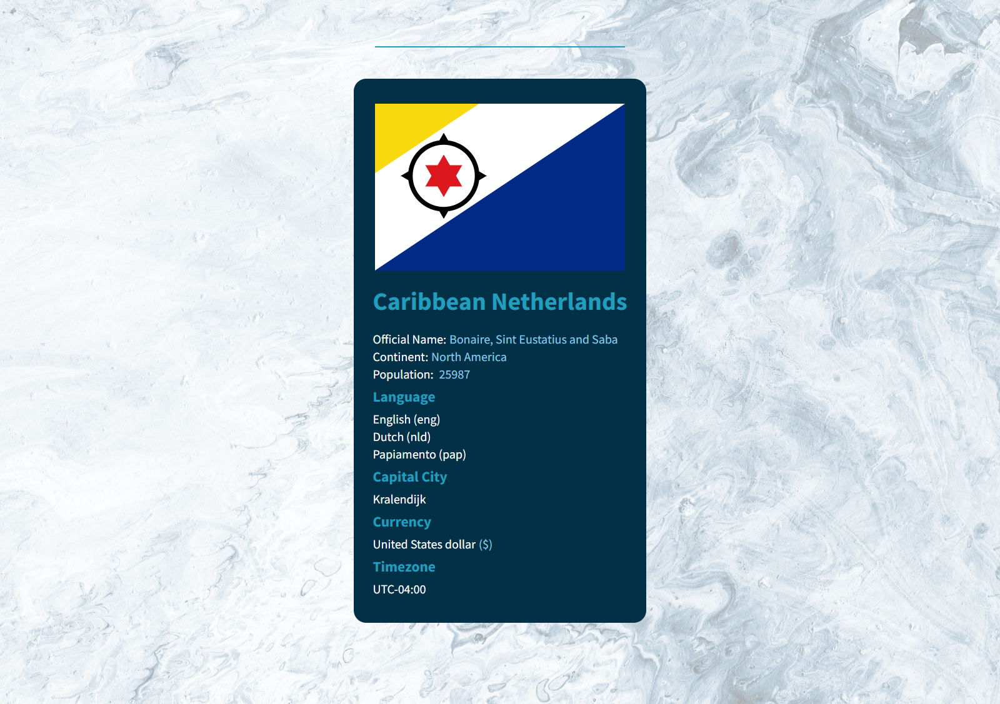

### State info ...

This basic react application displays information about a country if you enter the country's name. Basic informations include continent, population, language, capital city & curreny.

#### Project preview

#### Run application / Start guide

Clone this repo

##### `git clone git@github.com:sam4web/state_info.git`

Runs the app in the development mode.

##### `npm start`

Open [http://localhost:3000](http://localhost:3000) to view it in your browser.

---

This is a basic project for react beginners which uses [restcountries](https://restcountries.com/) api and is great for learning about topics like:

- JSX
- fetch api
- dark/light theme
- basic react stuff like components, props, usestate

_npm command `npm run build` doesn't work_
